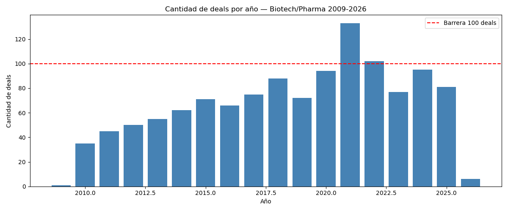
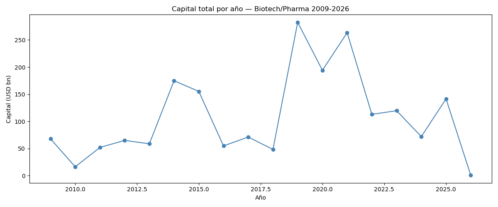
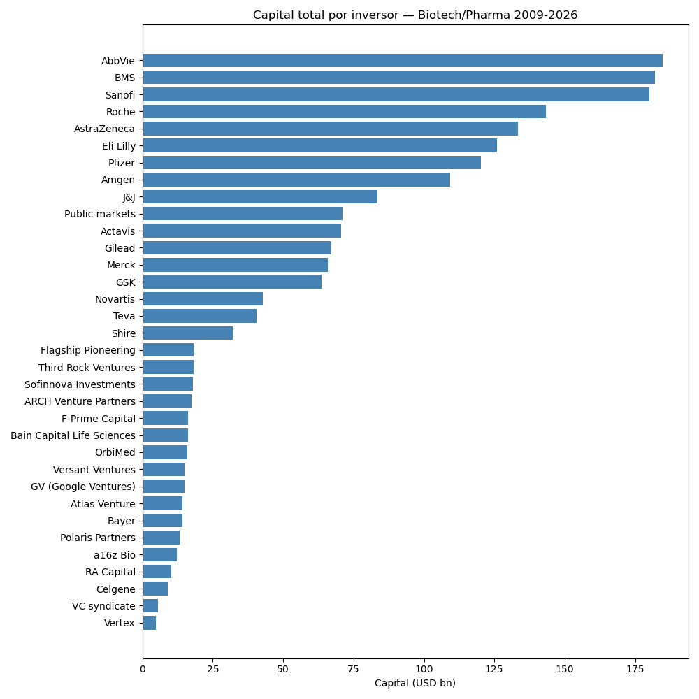
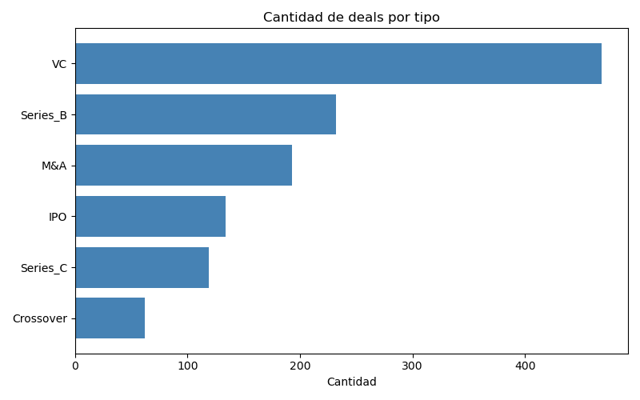

# Análisis Sector Biotech/Pharma 2009-2026

Proyecto de análisis de datos sobre el mercado global de inversiones en biotecnología y farmacéutica.
Cubre 1.208 operaciones entre 2009 y 2026 con un capital total de $1.949bn.

---

## Objetivo

Explorar patrones de inversión, identificar los principales actores del mercado,
y generar una estimación predictiva para el segundo semestre de 2026.

---

## Dataset

- **Fuente:** Dataset global de deals Biotech/Pharma
- **Período:** 2009 - 2026
- **Registros:** 1.208 operaciones
- **Columnas:** deal_id, date, year, deal_type, acquirer_or_investors,
  target_or_company, value_usd_bn, description, is_megadeal, is_real_headline

---

## Estructura del proyecto

biotech-analysis/
datos/
biotech_funding.csv
analisis/
01_auditoria.py
02_inversores.py
03_predictivo.py
README.md

---

## Análisis realizados

### Tarea 1 — Auditoría de datos
- Sin nulos, sin duplicados, sin inconsistencias de fechas
- Dataset limpio y listo para análisis
- Warning: definición de megadeal inconsistente (73 deals sobre P90 sin flag)

### Tarea 2 — Serie temporal
- Pico histórico: 2021 con 133 deals impulsado por pandemia
- Mayor capital: 2019 con $282bn (6 megadeals)
- Caída post-boom: -47% deals entre 2021 y 2023
- Recuperación moderada en 2024-2025

### Tarea 3 — Ranking de inversores
- 34 inversores para 1.208 deals — mercado concentrado
- Top 5 controla el 42% del capital total
- Pharma mueve 8x más capital que VC
- Caso extremo: Actavis compró Allergan por $70.5bn en un solo deal (2014)

### Tarea 4 — Modelo predictivo 2026
- Estimación: ~84 deals y ~$111bn de capital para 2026
- Método: promedio 2023-2025 (más honesto que regresión por distorsión del pico pandemia)
- Rango probable: 74-94 deals

## Visualizaciones

---

## Tecnologías usadas

- Python 3
- pandas
- scikit-learn
- numpy

---

## Autor

Fernando — proyecto de portfolio en Data Analytics
